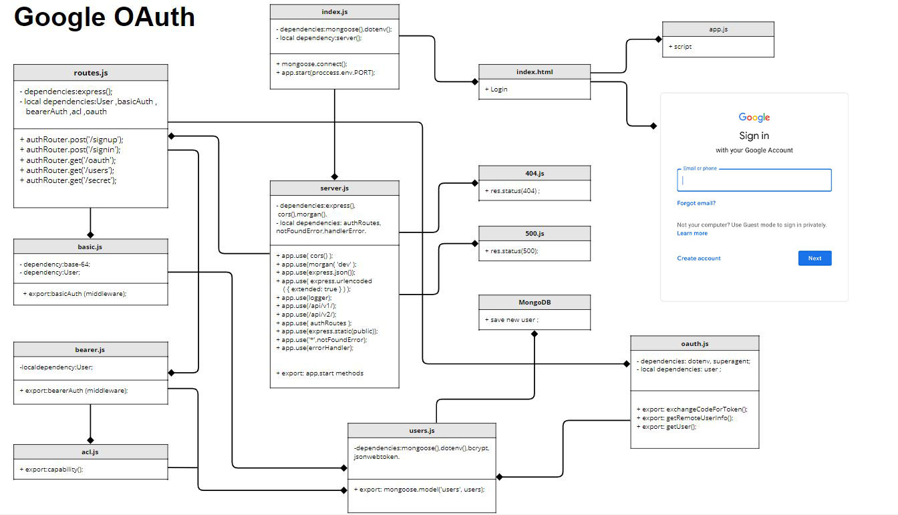

# Google-OAuth
### Lab-09

### [Repo Link](https://github.com/farahalwahaibi/google-Oauth)

### [Heroku App]()

***

## **Installation**
  * "@code-fellows/supergoose"
  * "base-64"
  * "bcrypt"
  * "cors"
  * "dotenv"
  * "eslint"
  * "express"
  * "jsonwebtoken"
  * "mongoose"
  * "morgan"
  * "superagent"

***

## **Setup**
* .env requirements
  * **PORT** - 3000
  * **MONGODB_URI**
  * **SECRET** - used to create jwt
  * **CLIENT_ID**
  * **CLIENT_SECRET**
  * **REDIRECT_URI**

***

## **Running the App**
* npm start || nodemon

***

## **UML Diagram**

